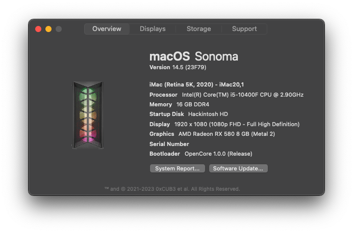

<div align="center">

<h1>OpenCore-H410M-K</h1>

OpenCore `1.0.0` EFI for my Hackintosh.

<b><p style="font-size: 150%;">Current latest version supported: Sonoma 14.4.1</p></b>


> The serial number was blanked to avoid SN duplication.


> This EFI uses `Acidanthera/GoldenGate` GUI. Image is an example, courtesy of Dortania.

<b>Hardware</b>
---------------

-----------------
| Component | Make & Model |
|-------|-----------------|
| **MB**|   ASUS Prime H410M-K|
| **CPU**|     Intel Core i5-10400F 6-core 12-threads|
| **RAM**|        16GB DDR4 2666 MHz|
| **GPU**| XFX AMD Radeon RX580 8GB OC+|
| **SSD1**|          Kingston A400 480GB (For Windows 10 Enterprise LTSC)|
| **SSD2**|          ADATA SU650 120GB (For macOS)|
| **Audio**|         Realtek ALC887/897|
| **Ethernet**|      Realtek RTL8111H|
| **Wifi**|          TP-Link Archer T2U|
| **Bluetooth**|     N/A        |           


<b>BIOS Settings</b>
-----------------
-----------------
| Settings | Status |
|-------|-----------------|
 | Secure Boot| 🔴 |
 | Intel SGX| 🔴 |
 | CSM*| 🔴 |
 | Fast Boot| 🔴 |
 | Intel Platform Trust*| 🔴 |
 | XHCI Hand-Off| 🟢 |
 | VT-d| 🟢 |
 | DVMT Pre-Allocated(iGPU Memory)* | 🟢  |
 | Set OS to `Other OS`| 🟢 |

> CSM disabled on certain GPUs may create issues with POST. You should test it before proceeding.

> On some BIOS versions, there is no setting for Intel Platform Trust. You can ignore this if it isn't present.

> In case you have an i5-10400 (not the F version), and an incompatible GPU, use the iGPU w/ 128MB.

<b>Kexts & Drivers used (all up-to-date as of June 2024)</b>
-----------------
|  Kexts |  Drivers |
|-------|-----------------|
| AppleALC| OpenCanopy  |
| CtlnaAHCIPort| OpenHfsPlus|
| Lilu| OpenRuntime |
| RTCMemoryFixup| ResetNvramEntry |
| RealtekRTL8111| ToggleSipEntry |
| RestrictEvents| |
| RtWlanU| |
| RtWlanU1827| |
| SMCProcessor| |
| SMCSuperIO| |
| USBPorts| |
| VirtualSMCv
| VoodooI2C| |
| VoodooI2CHID| |
| WhateverGreen| |

<b>Gathering macOS</b>
----------------------
Personally, I have used [Dortania's guide](https://dortania.github.io/OpenCore-Install-Guide/installer-guide/mac-install.html#making-the-installer-in-macos) for downloading a macOS package, but you can also use [gibMacOS](https://github.com/corpnewt/gibMacOS) if you encounter any issues.

**Note for Sonoma**: In case you are upgrading from Ventura to Sonoma and you are encountering boot loops when starting the macOS Installer, find your macOS Installer partition number in OpenCore EFI Shell and run:
```
\System\Library\CoreServices\boot.efi -v revpatch=sbvmm
```
On my system it worked without the patch. The `-v` is optional, but recommended for verbose outputting. It will make debugging easier.

Also, `SecureBootModel` is set to `Disabled` for Sonoma upgrade. If you want to enable it, use `j185` for `iMac20,1` SMBIOS.

<b>What's working</b>
---------------------
Everything works (except for AirDrop, Handoff, etc. since I don't have a BT adapter). All iCloud services, sleep, DRM and other normal anomalies on a Hackintosh work as it would on a real Mac.

<b>Post Installation</b>
------------------------
Make sure after you finished the installation to copy your EFI from the USB drive to your Hackintosh's EFI so you can boot without the use of the USB drive. If you have a hard time mounting the EFI partition, you can use [MountEFI](https://github.com/corpnewt/MountEFI). 

Also, update your SMBIOS, as this `config.plist` doesn't have a valid serial number on purpose. For this, use [GenSMBIOS](https://github.com/corpnewt/GenSMBIOS).

To edit `config.plist` in a graphical manner, you can use [ProperTree](https://github.com/corpnewt/ProperTree). Otherwise, you need to know how XML formatting works (I personally use `vim`).

<b>Credits</b>
--------------
Thanks to [Apple](https://apple.com) for [macOS](https://www.apple.com/macos/)

 Thanks to [Acidanthera](https://github.com/acidanthera) and [Dortania](https://github.com/dortania) for [OpenCore](https://github.com/acidanthera/OpenCorePkg), the needed kexts and drivers and the [guide](https://dortania.github.io/OpenCore-Install-Guide/) for creating all of this.
 
 Thanks to [CorpNewt](https://github.com/corpnewt) for all his automated tools.
 
 Thanks to [trongtinh1212](https://github.com/trongtinh1212) for his [EFI](https://github.com/trongtinh1212/H410M-K-Opencore). It was a massive help in building this one.
</div>
